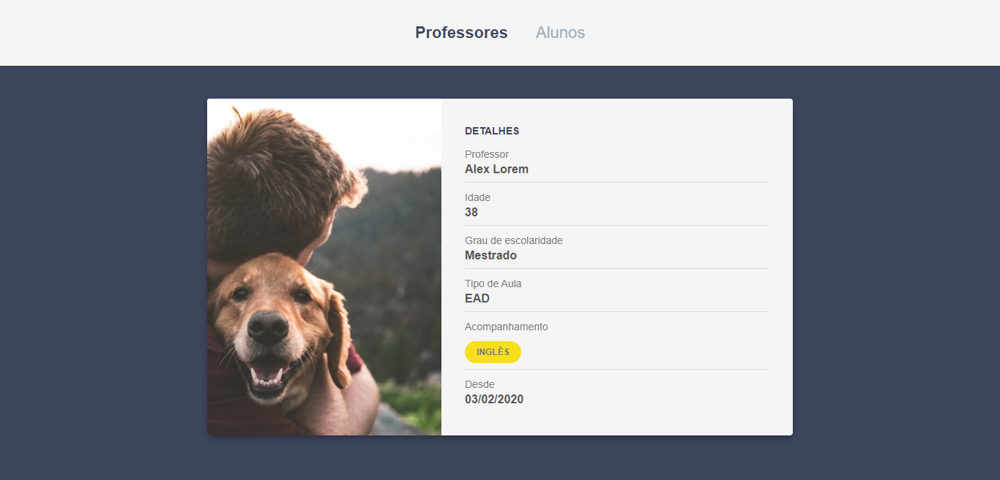

<h1 align="center">
    
</h1>

<h3 align="center">
  Desafio 4-2: Card do Professor
</h3>

<blockquote align="center">“Sua única limitação é você mesmo!”</blockquote>

## :rocket: Sobre o desafio

  

Nessa etapa você deve utilizar o browser-sync e criar um card para apresentação das informações do professor.

### Browser-sync

Utilizando as libs `browser-sync` e `npm-run-all` e rode os processos da sua aplicação e do `browser-sync` em paralelo.

### Card

Esse componente deve ser divido em duas seções: imagem e detalhes. As seguintes informações são obrigatórias:

- Imagem randômica de uma coleção de professores (utilize a api do unsplash);
- Nome completo;
- Idade;
- Grau de escolaridade (ex.: Doutorado);
- Tipo de aula (presencial ou à distância);
- Acompanhamento (ex.: Matemática e Física);
- Desde (data de cadastro na plataforma).

### Estilização

Você tem liberdade para escolher a estilização que preferir para esse desafio, mas alguns pontos são obrigatórios:

- A imagem deve ocupar 40% do card e os detalhes 60%.
- Utilize o seletor `first-child` e `border-top` para estilizar as divisórias entre os items.
- Utilize o seletor `nth-child()` para estilizar o label (ex.: Desde) e valor (ex.: 02/02/2020) do item.
- Utilize o `keyframes` e o `animation` para fazer uma animação do card.
- Utilize o `box-shadow` para aplicar uma sombra no card.