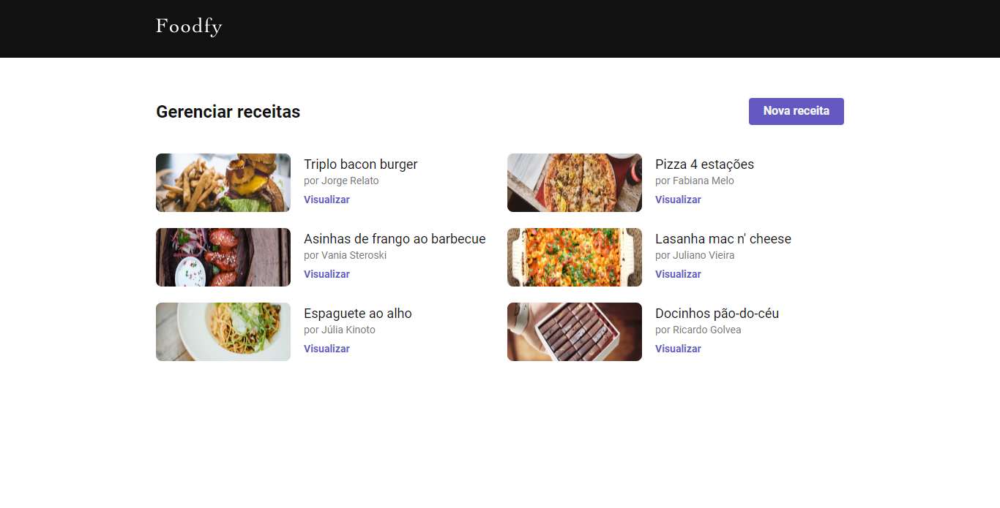
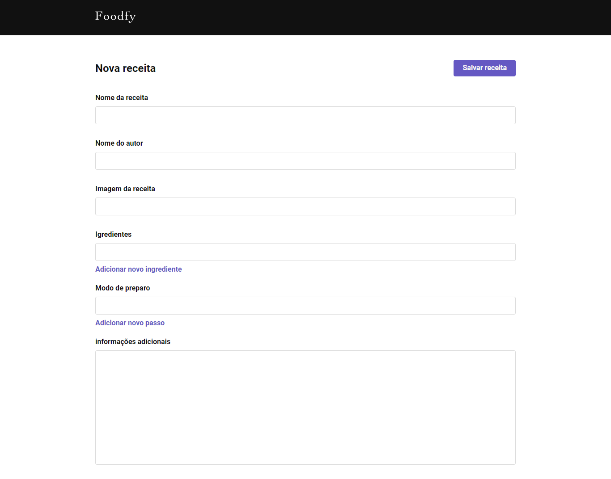
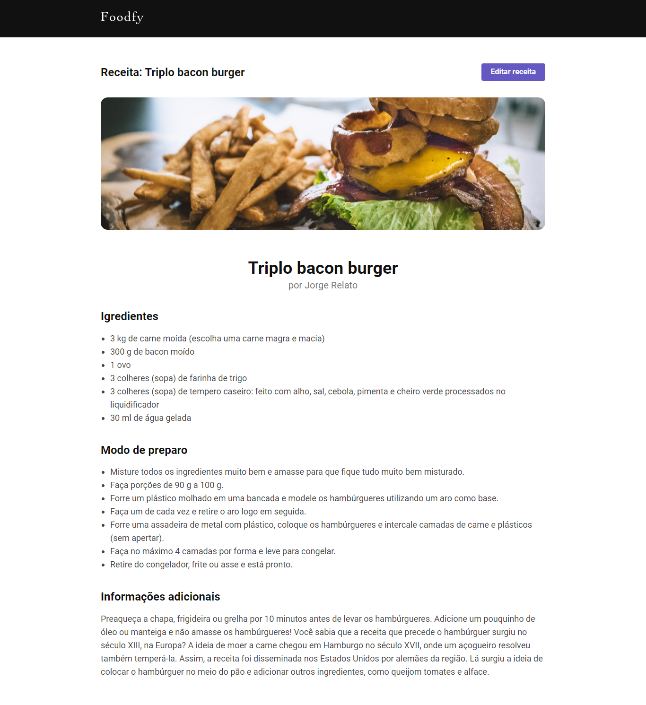
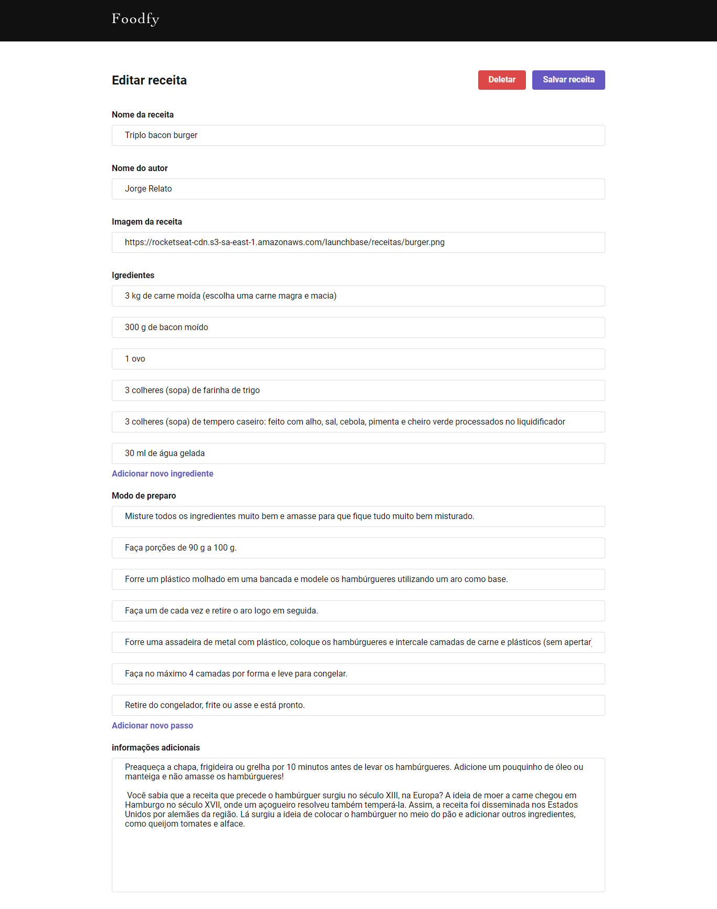

<h1 align="center">
    
</h1>

<h3 align="center">
  Desafio: Administração do Foodfy
</h3>

<blockquote align="center">“Quem sabe concentrar-se numa coisa e insistir nela como único objetivo, obtém a capacidade de fazer qualquer coisa.”</blockquote>

## :rocket: Sobre o desafio

Nesse desafio você irá criar uma área administrativa para o Foodfy, aplicação que desenvolvemos nos desafios anteriores.

Você utilizará o mesmo projeto do Foodfy desenvolvido no desafio anterior e somente adicionará essa área administrativa, responsável por cadastrar, editar e deletar os dados que estão no seu arquivo `data.js`.

### Rotas do administrador

Usando os conhecimentos adquiridos até aqui, você deve criar rotas para uma área administrativa, onde o usuário poderá cadastrar novas receitas, apresentá-las, além de atualizar e deletar também.

### Layout do painel de administração

   

### Criação de Receitas

   

### Adicionar Campo Dinâmico

Os campos de "Ingredientes" e "Modo de preparo", serão campos dinâmicos, onde você irá adicionar quantos campos forem necessários, usando JavaScript para isso.

### Detalhes da Receita

   

Para facilitar a busca de uma receita cadastrada, você pode usar a mesma forma de busca pelo index do `array` de `recipes` que foi apresentada no desafio anterior e desconsiderar o uso de um `id` único para cada receita, como apresentado nas aulas deste módulo.

### Edição da Receita

   

### Dados do projeto

No desafio passado você criou um arquivo de dados chamado `data.js` para servir de dados da sua aplicação.

Utilize agora, um arquivo que levará o nome `data.json` seguindo o que você aprendeu nesse módulo, porém, mantenha a estrutura de dados que você tinha no seu arquivo: `data.js`.

No `array` de `recipes` irão as receitas cadastradas pelo seu sistema.

A fim de testar as funcionalidades da sua área administrativa, cadastre por ela os dados que você tinha anteriormente no seu `data.js`

### Apresentação no site

Altere as rotas desenvolvidas no desafio anterior para exibir as receitas do novo arquivo `data.json` para o nosso site do Foodfy, no fim do desafio você deve ter então tanto a área administrativa do projeto quando o website consumindo os mesmos dados :smile: